<!-- ===================== HEADER ===================== -->

<p align="center">
  
</p>

<p align="center">
  <a href="https://github.com/ravinavadeep">
    
  </a>
  <a href="https://github.com/ravinavadeep?tab=followers">
    
  </a>
  <a href="https://github.com/ravinavadeep?tab=repositories">
    
  </a>
</p>

<br>

<!-- ===================== ABOUT ME ===================== -->

## 👋 About Me


Hi! I'm **Navadeep Raavi** 👋

🎓 B.Tech 2nd Year — **Computer Science & Artificial Intelligence (CAI)**  
🏫 Vignan Institute of Information Technology  
🐍 Currently learning **Python & DSA**  
🤖 Exploring **Artificial Intelligence & Machine Learning**  
💻 Interested in **Software Development & AI Engineering**  
🌱 Building my skills one project at a time  
🇮🇳 India

### 🎯 My Current Focus

```text
Python
   ↓
Data Structures & Algorithms
   ↓
Machine Learning
   ↓
Artificial Intelligence
   ↓
AI Engineering
